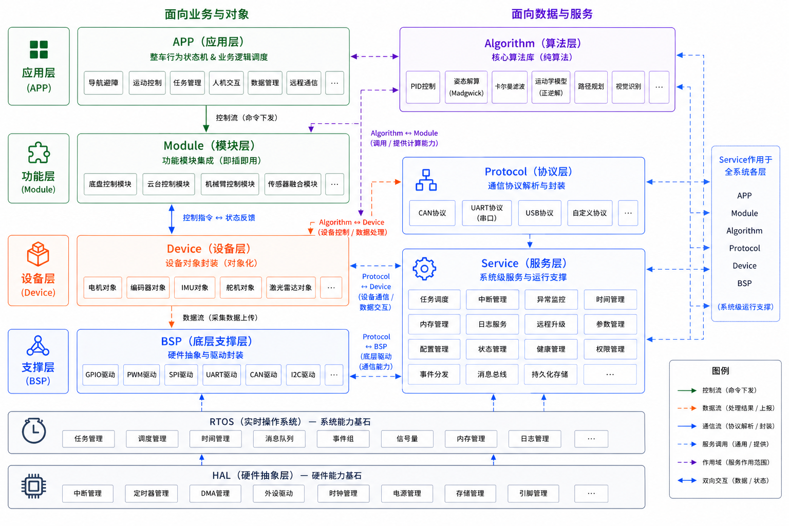

# CUBOT Code Rebuild：

## todo

- USB-HID
- SPI-Flash
- Cortex‑M7 内核相关
  - 分支预测
  - MPU 内存保护单元
  - Cache 缓存
- SPI、IIC、看门狗、DWT 驱动
- 多种电机驱动开发（DJI DM）
- 舵机、BMI088、及国产陀螺仪驱动
- 串口协议裁判系统、遥控器、云台、功率控制、发射机构、超电、底盘控制等等

## 具体文件树

```txt
root              
│                   │.clang-format         代码格式化设置 可以按照自己风格改
│                   │.clangd               clangd 语言服务器配置
│                   │.gitignore            git 忽略文件
│                   │CMakeLists.txt        主构建脚本
│                   │CMakePresets.json     CMake 预设配置
│                   │DM_MC02.ioc           STM32CubeMX 工程文件
│                   │README.md             本文件
│                   │startup_stm32h723xx.s 启动文件
│                   │STM32H723XG_FLASH.ld  链接脚本
│                   |---
├─.vscode           |`tasks`是终端执行的任务
|                   |如果想使用烧录和调试功能，需要工程名字和文件夹名字一样才可以（elf/hex文件名字和主文件夹名字相同）
├─build             |---
│  └─Debug          |编译出来的临时文件
├─cmake             |---
│  └─stm32cubemx    |STM32的库以及cmake链接方式
├─Core              |---
│  ├─Inc            |STM32的HAL层头文件
│  └─Src            |STM32的HAL层源文件
├─docs              |文档与图片
│  ├─分层规划图.png
│  └─CtrBoard-H7管脚标注图.pdf
├─Drivers           |STM32的Driver层文件
├─Flash             |个人写的烧录相关 工程名字和文件夹名字一样才可以烧录 写好了DAP和JLink 以及win和linux的烧录脚本 ozone
├─Middlewares       |官方生成的中间件库，FreeRTOS，USB
├─tinyusb-0.20.0    |TinyUSB库
└─User              |---
    ├─CMakeLists.txt  |User库一键导入配置
    ├─Bsp             |板载支持驱动
    │  ├─bsp_can.cpp / hpp
    │  ├─bsp_cfg.cpp / hpp
    │  ├─bsp_gpio_exti.cpp / hpp
    │  ├─bsp_uart.cpp / hpp
    │  ├─bsp_usb.cpp / hpp
    │  └─tusb_config.h
    ├─Device          |设备层
    │  ├─dm_imu.cpp / hpp
    │  └─JC2804.cpp / hpp
    ├─Module          |模块层（ 多个设备组合 ）（规划中）
    ├─Protocol        |协议层
    │  ├─data_pack.cpp / hpp
    │  └─protocol_uart.cpp / hpp
    ├─Algorithm       |算法层
    │  ├─pid.cpp
    │  └─pid.hpp
    ├─Service         |服务层（规划中）
    └─App             |应用层 / c cpp混编接口层
        ├─api_main.cpp
        └─api_main.h

```
我认为：ST官方生成的属于BSP的一部分 以及 Service的一部分

freertos的硬件支持、usb的硬件支持，外设封装好的支持等等，本质上都在硬件抽象（hal）。但是板载支持包（bsp）不仅要硬件抽象，是要完全不考虑硬件，只需要简易的使用代码就可以操控整个板子的外设，不需要考虑板子上的任意情况。这是bsp要做的，也是最麻烦的。

其他的device等等很好理解，只需要在写好的bsp层的基础上，对要做处理的设备进行处理即可



## 如何开发

### 配置：

1. 需要工程文件和主文件夹名称一样（烧录和调试都是使用的主文件夹名称作为的索引）
2. 编译烧录调试都使用vscode中的内容，后期可以使用外部调试工具（但是没有keil了）
3. 调整好各个插件，以及插件配置情况cortex debug、cmake、ninja、arm-gcc、clangd、git等等

### 使用：

配置使用CMake界面 / ST的插件

编译使用F7 或者 CMake界面 或者 ST的

烧录可以使用写好的脚本。写成了task可以直接调用（DAP JLink）

调试可以直接用调试栏目。写了cortex debug的内容，也配置了ozone的内容（但是ozone这个东西自己导入的居多）

Cortex-Debug可以看rtos的简单运行情况，内存使用情况，查看变量等等

### 因为底层驱动涉及cpp，解决方法：

严格在每一个.c .cpp中写接口转接文档，每个不能调用的东西都进行接口转接。

写接口转接文档，发现在嵌入式中，只需要给`main.c`进行转接，使用`api_main`来当作提取出来的main即可。这样写的中断回调 初始化 while循环都没啥问题，FreeRTOS也是这样，只需要`extern "C"` 就可以了

HAL库也早就写好了cpp调用c的`extern "C"`内容

作为c调用cpp的转接cpp文件的就写`api_xxxx.cpp`和`api_xxx.h` 作为区分 用**`h`**

正常cpp文件为：`xxx_yyyy.cpp` 和 `xxx_yyyy.hpp` 作为区分 用**`hpp`**

`xxx为 app bsp alg`

## 修改的文件

### CMakeList

为了更方便的添加.c .cpp文件 在User文件夹内添加了一个子文件夹的CMakeLists.txt，这些可以实现一键导入User的库

现在只需要在主CMakeLists.txt的最后一行添加：

```bash
##### User #####
add_subdirectory(User)

# Add stm32cubemx to User_lib
target_link_libraries(User_lib PRIVATE stm32cubemx)

# Add TinyUSB include to Userlib
target_include_directories(User_lib PUBLIC
    ${TINYUSB_DIR}/src
)

# Add User_lib to main
target_link_libraries(${CMAKE_PROJECT_NAME}
    User_lib

)


# 结尾部分
target_link_options(${CMAKE_PROJECT_NAME} PRIVATE -u _printf_float)

##### User #####
```

关于tinyusb，在user后面添加此内容

```bash

### Add TinyUSB sources ###
set(TINYUSB_DIR ${CMAKE_CURRENT_SOURCE_DIR}/tinyusb-0.20.0)
include(${TINYUSB_DIR}/src/CMakeLists.txt)
tinyusb_target_add(${CMAKE_PROJECT_NAME})

target_sources(${CMAKE_PROJECT_NAME} PRIVATE
    ${TINYUSB_DIR}/src/portable/synopsys/dwc2/dcd_dwc2.c
    ${TINYUSB_DIR}/src/portable/synopsys/dwc2/dwc2_common.c
)

# Add TinyUSB include to main
target_include_directories(${CMAKE_PROJECT_NAME} PRIVATE
    ${TINYUSB_DIR}/src
)

# Add project symbols (macros) <= tinyusb
target_compile_definitions(${CMAKE_PROJECT_NAME} PRIVATE
    # Add user defined symbols
    CFG_TUSB_MCU=OPT_MCU_STM32H7
    CFG_TUSB_OS=OPT_OS_FREERTOS
)

### Add TinyUSB sources ###
```

以及在最后一行，添加此内容，增加了对浮点数打印的支持

```bash
target_link_options(${CMAKE_PROJECT_NAME} PRIVATE -u _printf_float)
```

### .ld文件

为了DMA传输，把需要用到DMA的东西的存储，换到了DTCM之外

```c
__attribute__((section(".dma_buffer"))) 使用这一个缀修饰
```

修改ld文件的内容如下，中文注释之间为添加内容，多余的内容是定位用的

```c
  .fini_array (READONLY) : /* The "READONLY" keyword is only supported in GCC11 and later, remove it if using GCC10 or earlier. */
  {
    . = ALIGN(4);
    PROVIDE_HIDDEN (__fini_array_start = .);
    KEEP (*(SORT(.fini_array.*)))
    KEEP (*(.fini_array*))
    PROVIDE_HIDDEN (__fini_array_end = .);
    . = ALIGN(4);
  } >FLASH

 /* === 用户为dma传输配置的内存地址 === */

  .dma_buffer (NOLOAD) :
  {
    . = ALIGN(32);
    _sdma_buffer = .;
    *(.dma_buffer)
    *(.dma_buffer*)
    . = ALIGN(32);
    _edma_buffer = .;
  } >RAM_D1

  /* === 用户dma相关配置结束 === */

  /* used by the startup to initialize data */
  _sidata = LOADADDR(.data);

  /* Initialized data sections goes into RAM, load LMA copy after code */
  .data :
  {
    . = ALIGN(4);
    _sdata = .;        /* create a global symbol at data start */
    *(.data)           /* .data sections */
    *(.data*)          /* .data* sections */
    *(.RamFunc)        /* .RamFunc sections */
    *(.RamFunc*)       /* .RamFunc* sections */

    . = ALIGN(4);
  } >DTCMRAM AT> FLASH

```

### 让clangd 不报头文件未使用的错误（间接使用 clangd识别不出来）

使用： 在include头文件后面添加

`// IWYU pragma: keep`

可以规避 `Included header XXX.h is not used directly (fixes available)` 这个错误
